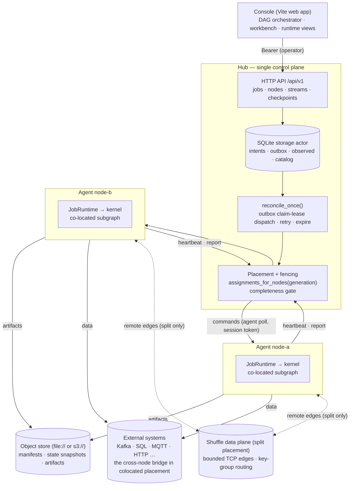
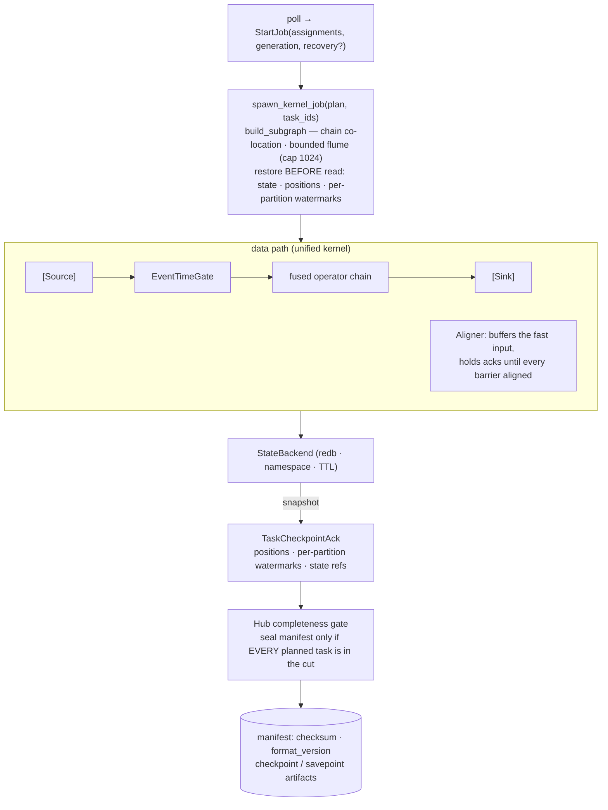

# Distributed Jobs

ArkFlow Jobs are the new runtime contract for stateful stream processing and
exist alongside the existing YAML Stream API. A Job is a graph of operators and
edges with stable IDs; submitting one produces an immutable `JobVersion` and a
physical task plan.

## Architecture

The Hub is a pure control plane: it persists intent (SQLite), makes placement
decisions, and aggregates observations. Agents are the data plane, each running
a subgraph of the unified kernel. By default an edge whose endpoints land on
different nodes is a placement error: agents then share only object storage
(recovery artifacts) and external systems (sources/sinks). A job that opts
into `placement: split` — with every participating node running a shuffle data
plane — additionally connects the agents with direct, bounded TCP channels
(see [Placement modes](#placement-modes) below).



Control flow runs top-down (write intent → outbox claim-lease dispatch → Agent
polls for commands); observation flows bottom-up (heartbeat lease renewal,
monotonic reports, generation fencing rejects stale generations).

## Event-time semantics

A Job can declare an event-time field, per-partition watermarks, an idle
partition timeout, and allowed lateness. The watermark is aggregated from the
minimum progress across active partitions; events beyond a window boundary are
handled by the `drop`, `route`, or `update` policy.

Event-time fields accept Int64 (milliseconds) and Arrow `Timestamp` columns in
seconds, milliseconds, microseconds, or nanoseconds — all normalized to
milliseconds; negative timestamps are rounded with the same `div_euclid` rule
as window boundaries, and overflow returns a field-localized error rather than
silently wrapping. **Null timestamps are never held indefinitely**: when
`route` is configured they follow late events into the side output, otherwise
they are dropped and acknowledged.

Within a batch, the watermark advances before the current rows are
classified: in a `[2100, 100]` batch, `100` is immediately handled by the late
policy and only genuinely future rows stay held. Window aggregations preserve
the input numeric type — a `Float64` sum is emitted as `Float64` and a
`Float32` as `Float32` with a compatible schema; `sum`/`min`/`max` no longer
degrade to integer sentinels (a **BREAKING** change; integer inputs remain
Int64). Non-integral sliding windows (`size=5, slide=2`) enumerate every window
start that contains an event timestamp instead of truncating with integer
division.

Triggered windows are retained for their allowed-lateness period: a late
`Update` within that period revises the same `(operator, key, window)`
aggregation and re-emits the full corrected result with an
`__arkflow_window_update` marker column; the buffer is only cleaned up after
the period expires.

## Embedded state and checkpoints

Hot-path state lives in an embedded KV store local to the Compute node,
isolated by job, operator, and key namespace, with TTL, size metering, and a
format version. A checkpoint writes a checksum-protected manifest containing
the state snapshot, source positions, and watermarks to shared object storage;
recovery restores state and source positions before reading any input.

On a single node, command-driven execution and checkpoint flow look like this:



### Acknowledged cut

A checkpoint's source positions, watermarks, operator state, and barriers must
all come from the same **acknowledged boundary**: before injecting a barrier,
the source chain drains in-flight (non-held) acknowledgements — each ack first
commits to the state journal, then advances the WAL cursor, and finally commits
the source-side offset — and only then is the immutable cut containing
positions and watermarks sealed. Mutations of stateful operators first enter
an execution-local journal and are committed to the state backend only after
their output has been acknowledged; on output or task failure they roll back,
so replays never double-apply. Multi-input chains capture a snapshot of the
committed epoch after barrier alignment, before releasing post-barrier data.
Acknowledgements held in window buffers do not block barriers: their state
stays staged, and recovery rebuilds it by replaying from the source positions.

Kafka checkpoint positions are the **highest contiguous acknowledged offset**
per topic-partition: fan-out branches that complete out of order cannot skip
unacknowledged records in a gap. A single source task keeps the connector's
full-partition subscription; only multiple physical tasks perform an explicit
partition assignment. On recovery the checkpointed positions are merged into
the complete configured assignment — partitions without a recorded position
keep their configured starting point, and the restored positions become the
cursor for the next checkpoint.

WAL-enabled inputs complete their durable flush before `read()` returns; on
ack, the WAL cursor advances first, then the native source offset commits.
Recovery folds the WAL contiguous prefix already covered by a checkpoint into
the local cursor, so filtered replays leave no acknowledgement gap.
Shutdown, reconnects, and the processor concurrency pool all listen for the
cancellation signal; on stop, workers and collectors are joined before
sources, sinks, and the WAL are closed.

Only a manifest carrying the complete planned task set is sealed as
Completed: missing, duplicate, or extra task entries cause rejection, and the
last valid recovery point is retained while a node is offline. **Upgrading to
a newer Job version is allowed when the state format matches** (a newer
version can restore an older savepoint); downgrades and format changes have no
migration path and are rejected on both sides.

## Control plane and compatibility

The Hub persists jobs, versions, task assignments, and recovery records, and
uses generations to keep stale task reports from overwriting newer intent.
Agents confirm the job runtime, state backend, and checkpoint protocol
versions through capability declarations. The legacy `Stream` YAML API is
neither converted nor removed and keeps running on its original path.

A job's observed status is derived from the aggregation of **all expected
assignments under the same (generation, action)**: running/stopped is reported
only when every assignment succeeds; anything still pending or retryably
degraded keeps the job converging, and one node's transient failure never
overrides healthy nodes. Checkpoint commits likewise require the complete set
of expected assignments; a partial result from an offline node is never
published as a recoverable artifact. Agents use a stable **process boot
identity** to distinguish real restarts and a registered session token to
protect requests; each re-registration restarts the report sequence at 0, and
late reports from an old session are rejected without rolling back the new
session's observation snapshot. Long checkpoints run in the background while
heartbeats, reports, and cancellation polls continue; command failures return
a terminal `Failed` result with correlation metadata.

Partition edges select the downstream task by the JobPlan's key-group range
rather than by modulo over physical source subtasks, so the same key arriving
from different source partitions still lands on the same downstream owner.
The legacy YAML Stream tumbling/session buffers keep their
"aggregate-then-pipeline" ordering and emit the original schema/rows; the
legacy row-count `sliding_window` is not misread as a time window, and
incompatible configurations fail at compile time with a migration hint.

### Placement modes

**Task placement has two modes**, selected by the job spec's `placement`
field.

With the default `placement: colocated`, an assignment never splits an edge
across two nodes, and Hub placement guarantees that adjacent operators sit on
the same Compute node: intermediate data never leaves its node, and horizontal
scale comes from source-partition splitting (e.g. spreading Kafka partitions
across nodes) and independent subtasks. Computations that need a shuffle
across the whole stream should chain two jobs through an external system (for
example a Kafka topic repartitioned by key) — or opt into `split`.

With `placement: split`, the Hub round-robins the plan's physical tasks across
the target nodes in deterministic plan order, so subtasks of the same operator
can land on different nodes. Edges whose endpoints end up on different nodes
are materialized as **remote network edges**: partitioned edges route records
by key-group range to the owning subtask over one bounded TCP channel per
(subtask-pair, operator-pair), with the same FIFO, barrier, watermark, and
acknowledgement semantics as local bounded channels — an upstream source ack
completes only after every downstream replica has acknowledged, and
window-held batches stay excluded from barrier drain exactly as locally. Side
edges — error sinks and late-event routes — must remain co-located; if a plan
would split one across nodes, the entire placement is rejected before
dispatch. The Hub dispatches `split` placements only to nodes that run a data
plane (a configured `health_check.data_port` with a routable
`health_check.data_host`, advertised as the `network_shuffle` capability);
otherwise placement fails closed with no partial dispatch. Deployments that
never set these fields keep the colocated behavior unchanged — no extra
listener, no capability, byte-identical placement.

### Failure and readiness semantics

Every validation entry point (`--validate`, the configuration API, local Jobs
declared in YAML, and compiled Streams) performs the same side-effect-free
deep build used at real startup: unknown components, unsupported state
backends, and illegal graph edges fail at validation time rather than at
runtime. WALs opened by a dry run are closed before it returns, and the same
redb path can be reopened immediately by a real runtime. A runtime that fails
a dry run, graph build, or resource connection after entering `Starting`
transitions to `Failed` before the error is returned; a local Job build
failure fails engine startup instead of announcing readiness while broken.
Temporary resources, sources, and sinks are connected in dependency order
before any task loop starts, and a partial startup closes the connected
resources in reverse order.

## API examples

```http
POST /api/v1/jobs/validate
POST /api/v1/jobs
PUT  /api/v1/jobs/{job_id}/desired-state
GET  /api/v1/jobs/{job_id}
GET  /api/v1/jobs/{job_id}/detail
GET  /api/v1/jobs/{job_id}/versions
POST /api/v1/jobs/{job_id}/checkpoints
POST /api/v1/jobs/{job_id}/savepoints
POST /api/v1/jobs/{job_id}/upgrades
POST /api/v1/jobs/{job_id}/upgrades/{upgrade_id}/rollback
```

Both the workbench and API clients should call `validate` to check the
compiled plan and node capabilities first, then submit with `stopped` and
inspect `detail`; switch to `running` only after confirmation. Version
upgrades require the job to be stopped and converged, with a completed
savepoint whose state format is compatible; when an upgrade fails the job
stays stopped and the operator explicitly restores the old version. The
checkpoint/savepoint lifecycle is bound to the job version and the state
format version.
