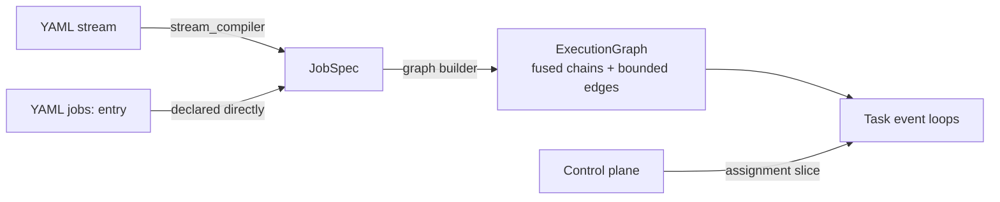

# The unified execution kernel

Everything ArkFlow runs — a single YAML `stream`, a local `jobs:` DAG, or a
job slice scheduled by the control plane — executes on **one kernel** in
`crates/arkflow-core/src/executor/`. There is no per-stream ad-hoc runtime to
reason about: understanding this page is understanding how all ArkFlow
workloads behave.

## From config to JobSpec

Compilation is deterministic:

- A `streams:` entry compiles via `stream_compiler.rs`: the input becomes a
  source operator, the processor chain fuses into map operators, the output
  becomes a sink, and window buffers compile to window operators. The WAL
  remains an input property, not a pipeline stage.
- A `jobs:` entry declares a `JobSpec` directly (`crates/arkflow-core/src/job.rs`).
- Join buffers do not compile: joining is an error at compile time.

## Graph and tasks

`graph.rs` builds an `ExecutionGraph`:

- **Operator-chain fusion** — adjacent operators run in one task on one event
  loop; no channel hop between fused operators.
- **Edge types** — `Forward` (same chain layout), `Partitioned` (key-group
  routed, required for keyed state), and `Broadcast`.
- **Bounded edges** — every inter-chain edge is a flume channel with capacity
  1024. Producers propagate backpressure; nothing buffers unboundedly.

`task.rs` runs each chain as an event loop over a single mailbox.

## Envelopes: data and control share the channel

`envelope.rs` defines the envelope model: data envelopes and control
envelopes (barriers, watermark/reset signals) travel over the **same bounded
channels**. This is what makes asynchronous checkpointing possible without a
second control plane: a barrier is queued exactly where data flows, so it
marks a *cut* in the stream that respects data ordering per chain.

## Checkpoint barriers

`barrier.rs` implements alignment:

- Each chain's event loop feeds an `Aligner`; the `BarrierCoordinator`
  collects per-chain snapshots into a `ChainSnapshot`.
- A checkpoint completes when all participating sources and stateful tasks
  acknowledge the barrier and durable state files verify — the manifest then
  represents one acknowledged cut (job version, assignments, source
  positions, watermarks, state snapshots, format versions, checksums).
- Fused chains keep a deterministic mapping from every planned task to its
  chain snapshot; an incomplete task set can never complete a checkpoint.

See [Recovery](../operate/recovery.md) for the operator-facing behavior.

## Commit protocol

`commit.rs` tracks a `CommitFrontier` with `AckAdvance` and `CheckpointCut`:

- Acknowledgements advance the frontier only through the **highest contiguous
  acked sequence** — a fast ack at N+1 never exposes a cursor past a missing
  N.
- Downstream output confirmations gate both the WAL cursor and source-side
  commits; an output failure withholds the commit and the record is retried.
- `state_journal.rs` journals stateful mutations (`StateTxn`, `CommitOnAck`):
  mutations stage in the journal and commit when the processing ack arrives,
  so a crash between compute and commit leaves the previous committed state
  intact.

## Event time and windows

- `event_time_gate.rs` gates records by event time so late data is handled
  deterministically.
- `window.rs` implements the columnar window operator (`ColumnarWindowOperator`
  with `WindowKind` and `WindowTrigger`) — windows aggregate `RecordBatch`
  columns directly instead of row-at-a-time.
- A fired window commits its state **before** acking its input.

## Resource governance

`resource_guard.rs` bounds per-job resources so a co-located job cannot
starve its neighbors on a compute node — the control plane relies on this
when colocating multiple job slices on one node.

## Module map

| Module | Responsibility |
|--------|----------------|
| `stream_compiler.rs` | `StreamConfig` → `JobSpec` |
| `graph.rs` | `ExecutionGraphBuilder`, fusion, edges |
| `task.rs` | Per-chain event loops (`run_graph`) |
| `envelope.rs` | Data + control envelopes |
| `barrier.rs` | `Aligner`, `BarrierCoordinator`, `ChainSnapshot` |
| `commit.rs` | `CommitFrontier`, `AckAdvance`, `CheckpointCut` |
| `state_journal.rs` | `StateTxn`, `CommitOnAck` |
| `window.rs` | Columnar window operator |
| `event_time_gate.rs` | Event-time gating |
| `stream_adapter.rs` | `StreamJobAdapter`, WAL input |
| `job_runner_adapter.rs` | `run_job*` entry points |
| `kernel_handle.rs`, `metrics.rs`, `resource_guard.rs` | Handles, metrics, limits |

## Normative specs

The behavior above is pinned by openspec specs under `openspec/specs/` —
notably `unified-execution-kernel`, `async-checkpoint-barriers`,
`checkpoint-recovery`, `keyed-state-backend`, `stream-backpressure`, and
`columnar-window-operators`. Change kernel behavior together with its spec.
