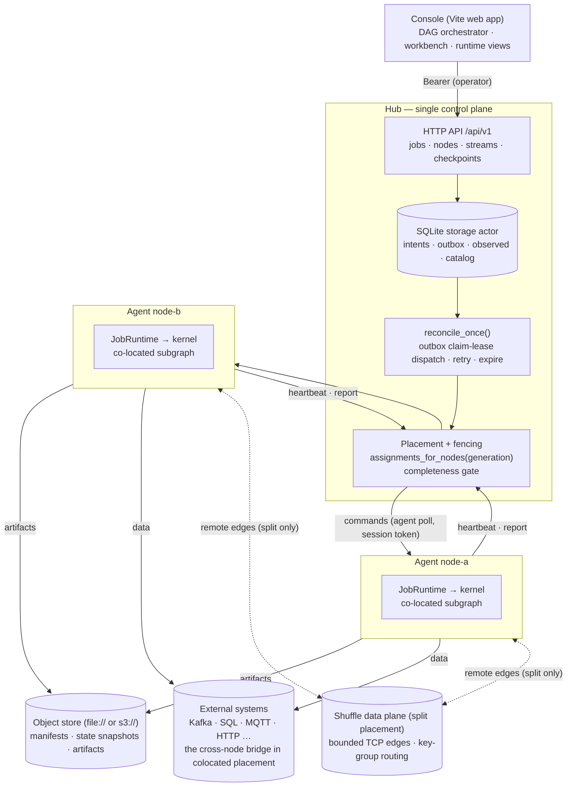
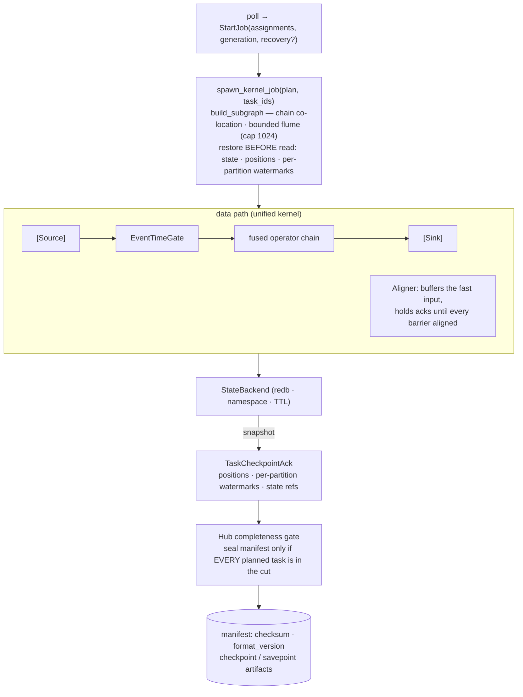

# 分布式作业

ArkFlow 作业(Job)是有状态流处理的新运行时契约,与现有 YAML 流 API 并存。一个作业是带有稳定 ID 的算子与边的图;提交一个作业会生成不可变的 `JobVersion` 与一份物理任务计划。

## 架构

Hub 是纯控制平面:它持久化意图(SQLite)、做出放置决策并聚合观测。Agent 是数据面(data plane),各自运行统一内核的一个子图。默认情况下,端点落在不同节点上的边是放置错误:Agent 之间只共享对象存储(恢复工件)与外部系统(源/sink)。选择 `placement: split` 的作业——要求每个参与节点运行 shuffle 数据面——还会额外用直连的有界 TCP 通道把各 Agent 连接起来(参见下文[放置模式](#放置模式))。



控制流自上而下(写意图 → outbox 认领租约派发 → Agent 轮询命令);观测自下而上(心跳续租、单调递增的报告,作业代数(generation)隔离(fencing)拒绝陈旧的 generation)。

## 事件时间语义

作业可以声明事件时间字段、每分区水印(Watermark)、空闲分区超时与允许迟到时间。水印由活跃分区之间的最小进度聚合而来;超出窗口边界的事件由 `drop`、`route` 或 `update` 策略处理。

事件时间字段接受 Int64(毫秒)以及以秒、毫秒、微秒或纳秒为单位的 Arrow `Timestamp` 列——全部归一化为毫秒;负时间戳与窗口边界一样按 `div_euclid` 规则取整,溢出则返回字段级错误而不是静默回绕。**Null 时间戳不会被无限期持有**:配置了 `route` 时,它们随迟到事件进入侧输出,否则被丢弃并确认。

在一个批次内,水印先于当前行的分类而推进:在 `[2100, 100]` 批次中,`100` 会立即由迟到策略处理,只有真正属于未来的行才被保持。窗口聚合保留输入数值类型——`Float64` 求和以 `Float64` 输出,`Float32` 以 `Float32` 输出且 schema 兼容;`sum`/`min`/`max` 不再退化为整数哨兵值(**BREAKING** 变更;整数输入仍为 Int64)。非整数滑动窗口(`size=5, slide=2`)会枚举包含事件时间戳的每个窗口起点,而不是用整数除法截断。

已触发的窗口会在允许迟到期内保留:该期间内迟到的 `Update` 会修订同一个 `(operator, key, window)` 聚合,并附带 `__arkflow_window_update` 标记列重新发出完整的修正结果;缓冲只在期限过期后才清理。

## 内嵌状态与检查点(Checkpoint)

热路径状态位于 Compute 节点本地的内嵌 KV 存储中,按作业、算子与键命名空间隔离,带 TTL、容量计量与格式版本。检查点把包含状态快照、源位置与水印的带校验和保护的 manifest 写入共享对象存储;恢复在任何输入读取之前先恢复状态与源位置。

在单节点上,命令驱动的执行与检查点流程如下:



### 已确认切面

检查点的源位置、水印、算子状态与屏障(Barrier)必须全部来自同一个**已确认边界**:注入屏障之前,源链先排空在途(非持有)的确认——每个 ack 先提交到状态日志,再推进 WAL 游标,最后提交源侧偏移量(offset)——之后才封存包含位置与水印的不可变切面。有状态算子的变更先进入执行本地的日志,只有在其输出被确认之后才提交到状态后端;输出或任务失败时回滚,因此重放不会重复应用。多输入链在屏障对齐之后、放行屏障后数据之前捕获已提交 epoch 的快照。窗口缓冲中持有的确认不会阻塞屏障:其状态保持暂存,恢复时通过从源位置重放来重建。

Kafka 检查点位置是每个 topic-partition 的**最高连续已确认偏移量**:完成顺序乱序的扇出分支无法跳过间隙中未确认的记录。单一源任务保持连接器的全分区订阅;只有多个物理任务才执行显式分区分配。恢复时,检查点位置被合并进完整的已配置分配——没有记录位置的分区保持其配置的起点,恢复出的位置成为下一次检查点的游标。

启用 WAL 的输入在 `read()` 返回前完成持久刷盘;ack 时 WAL 游标先前进,然后才提交数据源的原生偏移量。恢复会把检查点已覆盖的 WAL 连续前缀折入本地游标,因此过滤后的重放不会留下确认缺口。关闭、重连与处理器并发池都监听取消信号;停止时,先 join 工作者与收集器,再关闭源、sink 与 WAL。

只有携带完整计划任务集的 manifest 才会封存为 Completed:缺失、重复或多余的任务条目都会被拒绝,而节点离线期间会保留最后一个有效恢复点。**状态格式匹配时允许升级到更新的作业版本**(新版本可以恢复旧的 savepoint);降级与格式变更没有迁移路径,双方都会拒绝。

## 控制平面与兼容性

Hub 持久化作业、版本、任务分配与恢复记录,并使用 generation 防止陈旧的任务报告覆盖更新的意图。Agent 通过能力声明确认作业运行时、状态后端与检查点协议版本。旧式 `Stream` YAML API 既不转换也不移除,继续在原有路径上运行。

作业的观测状态派生自**同一 (generation, action) 下全部预期分配**的聚合:只有每个分配都成功时才报告 running/stopped;仍在 pending 或可重试降级的部分会让作业保持收敛,单个节点的瞬时失败绝不会覆盖健康节点。检查点提交同样要求预期分配的完整集合;离线节点的部分结果永远不会作为可恢复工件发布。Agent 使用稳定的**进程启动标识**区分真实重启,并用注册的会话令牌保护请求;每次重新注册都把报告序列重置为 0,旧会话的迟到报告会被拒绝,而不会回滚新会话的观测快照。长时间的检查点在后台运行,心跳、报告与取消轮询继续进行;命令失败返回带关联元数据的终态 `Failed` 结果。

分区边按 JobPlan 的键组范围选择下游任务,而不是对物理源子任务取模,因此来自不同源分区的相同键仍会落在同一下游所有者上。旧式 YAML 流的滚动/会话缓冲保持"先聚合后流水线"的顺序并输出原始 schema/行;旧式按行数的 `sliding_window` 不会被误读为时间窗口,不兼容的配置在编译期失败并给出迁移提示。

### 放置模式

**任务放置有两种模式**,由作业规格的 `placement` 字段选择。

默认的 `placement: colocated` 下,一次分配绝不会把一条边拆到两个节点,Hub 放置保证相邻算子位于同一 Compute 节点:中间数据从不离开其所在节点,水平扩展来自源分区拆分(例如把 Kafka 分区摊到多个节点)与独立子任务。需要跨整条流 shuffle 的计算应当经由外部系统串联两个作业(例如一个按键重新分区的 Kafka topic)——或者选择 `split`。

`placement: split` 下,Hub 按确定性的计划顺序把计划的物理任务轮转分配到目标节点,因此同一算子的子任务可能落在不同节点。端点落在不同节点上的边被物化为**远程网络边**:分区边按键组范围把记录路由到拥有它的子任务,每个 (子任务对, 算子对) 一条有界 TCP 通道,具备与本地有界通道相同的 FIFO、屏障、水印与确认语义——上游源 ack 只有在每个下游副本都确认之后才完成,窗口持有的批次与本地完全一样地被排除在屏障排空之外。旁路边——错误 sink 与迟到事件路由——必须保持同位共置;如果计划会把某条旁路边拆到跨节点,整个放置会在派发前被拒绝。Hub 只把 `split` 放置派发给运行数据面的节点(配置了 `health_check.data_port` 且 `health_check.data_host` 可路由,并以 `network_shuffle` 能力宣告);否则放置直接失败(fail closed),不做部分派发。从不设置这些字段的部署保持共置行为不变——没有额外监听器、没有能力宣告、放置结果逐字节相同。

#### 资源感知放置与再均衡

当作业未用 `node_ids` 固定目标节点时,Hub 在每次放置前按资源余量为候选节点排序:有最新资源指标的节点优先(内存可用量降序、CPU 余量降序、节点 ID 升序),未上报指标的节点按 ID 序排在最后。排序后的集合仍走同一套确定性轮转,且被保留的放置总是按最初派发顺序重新分发,因此作业的 task→node 映射不会在多次派发之间漂移。

默认情况下,放置成功后永不再移动。作业可通过 `rebalance` 策略显式开启再均衡:当所在节点的资源压力(内存占用或 CPU 超过阈值)连续多个上报周期持续存在、且作业级冷却期已过时,Hub 会把作业迁移走——迁移复用与节点闪断相同的 fencing 重放置路径:被弃节点的 start 被置为 superseded 并收到 stop 命令,剩余最优节点上始终只有一个运行实例。迁移与其余重放置一样从最近 checkpoint 恢复;固定 `node_ids` 的作业不能与 `rebalance: auto` 组合。

```yaml validate=full
streams: []
jobs:
  - id: rebalanced-orders
    version: 1
    placement: split
    rebalance:
      mode: auto            # off (default) | auto
      pressure_streak: 3    # consecutive pressuring reports before a move
      cooldown_ms: 300000   # minimum delay between relocations
    operators:
      - id: source
        kind: source
      - id: sink
        kind: sink
    edges:
      - id: source-sink
        from: source
        to: sink
    sources:
      - operator_id: source
        input_type: memory
        time:
          mode: processing_time
    sinks:
      - operator_id: sink
        output_type: drop
```

### 失败与就绪语义

每个校验入口(`--validate`、配置 API、YAML 中声明的本地作业以及编译后的流)都执行与真实启动相同的无副作用深度构建:未知组件、不支持的状态后端与非法图边在校验期失败,而不是在运行时。dry run 打开的 WAL 会在其返回前关闭,同一 redb 路径可以立即被真实运行时重新打开。进入 `Starting` 之后,dry run、图构建或资源连接失败的运行时会在错误返回前转换为 `Failed`;本地作业构建失败会让引擎启动失败,而不是在损坏状态下宣告就绪。临时资源、源与 sink 按依赖顺序在任何任务循环启动之前连接,部分启动则以相反顺序关闭已连接的资源。

### 双流 join 边界

引擎当前在任何入口都不支持双流 join:Job DAG 在校验期拒绝 `Join` 算子,流式配置的 legacy `join` buffer(含带 legacy `join` 字段的窗口 buffer)以同样的指引编译失败——两条拒绝路径都不会指向不存在的入口。在原生 join 算子落地之前,可使用以下替代:

- **SQL processor 对临时表的批内 join**:一侧走 SQL processor,另一侧注册为临时表。每个在途批次与表数据 join,不维护跨流状态。
- **外部共置**:通过外部系统(例如按 join key 重分区的 Kafka 主题)把两个流共置到同一 key 上,作为单流处理,再用 keyed processor 或窗口做关联。

## API 示例

```http
POST /api/v1/jobs/validate
POST /api/v1/jobs
PUT  /api/v1/jobs/{job_id}/desired-state
GET  /api/v1/jobs/{job_id}
GET  /api/v1/jobs/{job_id}/detail
GET  /api/v1/jobs/{job_id}/versions
POST /api/v1/jobs/{job_id}/checkpoints
POST /api/v1/jobs/{job_id}/savepoints
POST /api/v1/jobs/{job_id}/upgrades
POST /api/v1/jobs/{job_id}/upgrades/{upgrade_id}/rollback
```

工作台与 API 客户端都应先调用 `validate` 检查编译计划与节点能力,再以 `stopped` 提交并查看 `detail`;确认之后才切换到 `running`。版本升级要求作业已停止且收敛,并持有状态格式兼容的已完成 savepoint;升级失败时作业保持停止,由操作者显式恢复旧版本。检查点/savepoint 生命周期绑定到作业版本与状态格式版本。
