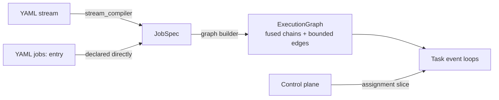

# 统一执行内核

ArkFlow 运行的一切——单个 YAML `stream`、本地 `jobs:` DAG,或由控制平面调度的作业切片——都在 `crates/arkflow-core/src/executor/` 的**同一个内核(kernel)**上执行。不存在需要另行理解的每流专用运行时:理解了本页,就理解了所有 ArkFlow 工作负载的行为。

## 从配置到 JobSpec

编译是确定性的:

- `streams:` 条目经 `stream_compiler.rs` 编译:输入成为 source 算子,处理器链融合为 map 算子,输出成为 sink,窗口缓冲编译为窗口算子。WAL 仍是输入的属性,而不是流水线阶段。
- `jobs:` 条目直接声明 `JobSpec`(`crates/arkflow-core/src/job.rs`)。
- Join 缓冲不能编译:join 在编译期是一个错误。

## 图与任务

`graph.rs` 构建 `ExecutionGraph`:

- **算子链融合** —— 相邻算子在同一个事件循环上的同一个任务中运行;融合的算子之间没有通道跳转。
- **边类型** —— `Forward`(相同链布局)、`Partitioned`(按键组路由,键控状态必需)与 `Broadcast`。
- **有界边** —— 每条链间边都是容量为 1024 的 flume 通道。生产者传播背压;任何地方都不会无界缓冲。

`task.rs` 把每条链运行为单个邮箱上的事件循环。

## 信封:数据与控制共享通道

`envelope.rs` 定义了信封(envelope)模型:数据信封与控制信封(屏障、水印/重置信号)经由**相同的有界通道**传输。这正是无需第二个控制平面即可实现异步检查点的原因:屏障恰好排在数据流经的位置,因此它在流中标记出一个尊重每条链数据顺序的*切分点*。

## 检查点屏障

`barrier.rs` 实现对齐:

- 每条链的事件循环喂给一个 `Aligner`;`BarrierCoordinator` 把各链快照收集为 `ChainSnapshot`。
- 当所有参与的 source 与有状态任务确认屏障、且持久化状态文件校验通过后,检查点(checkpoint)完成——此时 manifest 表示一个已确认的切分点(作业版本、分配、源位置、水印、状态快照、格式版本、校验和)。
- 融合链为每个计划任务保留到其链快照的确定性映射;任务集合不完整时,检查点永远无法完成。

面向操作者的行为参见[恢复](/zh-Hans/docs/operate/recovery)。

## 提交协议

`commit.rs` 通过 `AckAdvance` 与 `CheckpointCut` 跟踪 `CommitFrontier`:

- 确认只沿**最高连续已确认序列**推进前沿——N+1 处的快速确认绝不会把游标暴露过缺失的 N。
- 下游输出确认同时门控 WAL 游标与源侧提交;输出失败会扣留提交并重试该记录。
- `state_journal.rs` 为有状态变更记账(`StateTxn`、`CommitOnAck`):变更先在日志中暂存,待处理确认到达后提交,因此在计算与提交之间崩溃时,先前已提交的状态仍然完好。

## 事件时间与窗口

- `event_time_gate.rs` 按事件时间门控记录,使迟到数据的处理具有确定性。
- `window.rs` 实现列式窗口算子(带 `WindowKind` 与 `WindowTrigger` 的 `ColumnarWindowOperator`)——窗口直接对 `RecordBatch` 列做聚合,而不是逐行处理。
- 已触发的窗口**先**提交自身状态,**再**确认输入。

## 资源治理

`resource_guard.rs` 限制每个作业的资源,使同置的作业无法在计算节点上饿死邻居——控制平面在一台节点上同置多个作业切片时依赖这一点。

## 模块地图

| 模块 | 职责 |
|--------|----------------|
| `stream_compiler.rs` | `StreamConfig` → `JobSpec` |
| `graph.rs` | `ExecutionGraphBuilder`、融合、边 |
| `task.rs` | 每链事件循环(`run_graph`) |
| `envelope.rs` | 数据 + 控制信封 |
| `barrier.rs` | `Aligner`、`BarrierCoordinator`、`ChainSnapshot` |
| `commit.rs` | `CommitFrontier`、`AckAdvance`、`CheckpointCut` |
| `state_journal.rs` | `StateTxn`、`CommitOnAck` |
| `window.rs` | 列式窗口算子 |
| `event_time_gate.rs` | 事件时间门控 |
| `stream_adapter.rs` | `StreamJobAdapter`、WAL 输入 |
| `job_runner_adapter.rs` | `run_job*` 入口 |
| `kernel_handle.rs`、`metrics.rs`、`resource_guard.rs` | 句柄、指标、限制 |

## 规范性规格

上述行为由 `openspec/specs/` 下的 openspec 规格固定——特别是 `unified-execution-kernel`、`async-checkpoint-barriers`、`checkpoint-recovery`、`keyed-state-backend`、`stream-backpressure` 与 `columnar-window-operators`。修改内核行为时,请连同其规格一起修改。
